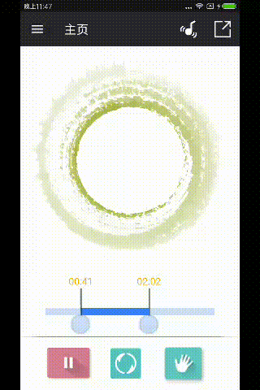
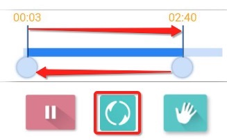

# Mp3Cutter，个人原创的mp3剪切小工具。

> 适用于剪切制作手机铃声以及闹铃等用途，功能简单易用、界面风格简洁，采用MaterialDesign设计规范。

- 首页使用了CoordinatorLayout+AppBarLayout+DrawerLayout+NavigationView的经典MD设计风格。
- 项目整体采用了MVP+databinding+rxjava+dagger框架，数据缓存使用了greendao。
- 音频频谱的绘制主要是通过Visualizer中获取到的波形数据来进行绘制。
- mp3剪切核心功能使用了jaudiotagger jar包根据时间获取到文件中的数据标记位置。

## 使用说明+gif
### Step1. 选择mp3文件

### Step2. 通过滑块选择剪切范围然后点击剪切按钮

### 操作技巧：使用**切换**按钮切换当前播放的滑块

## 感谢
* [jaudiotagger](http://www.jthink.net/jaudiotagger/)
* [RXJava](https://github.com/ReactiveX/RxJava)
* [RxAndroid](https://github.com/ReactiveX/RxAndroid)
* [greendao](https://github.com/greenrobot/greenDAO)
* [StatusBarUtil](https://github.com/laobie/StatusBarUtil)
* [Dagger2](https://github.com/google/dagger)
* [PermissionsDispatcher](https://github.com/permissions-dispatcher/PermissionsDispatcher)
* [logger](https://github.com/orhanobut/logger)
* [AVLoadingIndicatorView](https://github.com/81813780/AVLoadingIndicatorView)
* [baseAdapter](https://github.com/hongyangAndroid/baseAdapter)
* [CustomRangeSeekBar](https://github.com/zyl409214686/CustomRangeSeekBar)

## TODO
- 增加主题颜色设置
- 增加频谱的样式设置
- 增加闹铃的设置
- 增加对音乐文件的处理如分享等
- 国际化支持

## 关于我

一个来自于北京的android开发者

## 联系我
 - Email: zyl409214686@163.com
 - Blog : [blog](http://www.zouyulong.com)
 - GitHub: [zyl409214686](https://github.com/zyl409214686)

##  License

Mp3Cutter is under CC BY-NC-SA license.